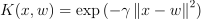
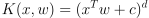
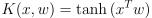

# Overview
## About
This repository is a PyTorch implementation of Kervolutional Neural Network (CVPR 2019). You can read about it in detail here: https://arxiv.org/abs/1904.03955

This overview will be a very brief introduction to the concept of "Kernel Convolution" (or "kervolution" as the authors'd like to call it) so that you can understand it better without having to read the paper in full. However, it is still recommended that you should read the paper in its entirety to understand the concept fully.
## What is "Kernel Convolution"?
As we know, a neural network is a collection layers connected by a variety of activation functions to form an end-to-end sequence of computation. The goal is to learn a function or a statistical model with great complexity that can produce a prediction for every unseen input with a satisfactory level of statistical error.

To achieve that goal, every activation function in the network must be non-linear, as a combination of multiple linear functions is simply another linear function. As we know, linear functions have a very limited discriminating power.

In a Convolutional Neural Network (CNN), however, convolution layers can only learn linear features from the inputs as convolution (or cross-correlation) itself is a linear operation. So the idea is to counteract the inherently linear nature of the convolution operation with a non-linear function. However, non-linear functions come with a non-linear computational complexity growth ('exponential' mostly and unfortunately)
## The Kernel Trick
To counteract the aforementioned exponential growth of the computational complexity, we will utilize something called "the kernel trick". This techniques allow us to calculate the result of a combination of two non-linear computations without having to do the computations ourselves. Thus, we practically achieve a linear-time complexity for a non-linear computation. The "kernel trick" is widely used in SVM to project data points into higer dimensions for easy linear separation without compromising computational cost.

I won't go into details about the kernel trick, but I will briefly introduce the kernels that are implemented in this repository:

**Gaussian Kernel (Radial Basis Function)**



**Polynomial Kernel**



**Sigmoid Kernel**


# Requirements
The code is written using the following environment. There isn't a strict version requirement, but deviate from the listed versions at your own risk

* python: 3.7.3
* pytorch: 1.2.0
* torchvision: 0.4.0

# Tutorials
## Creating a kernel convolution layer
```python
from kernel_conv.kernels import *
from kernel_conv.conv import KernelConv2d

# Create a kernel to use for your convolution layers
# There are currently 3 to choose from
gaussian_kernel = GaussianKernel(gamma=0.5)
polynomial_kernel = PolynomialKernel(c=0, degree=3)
sigmoid_kernel = SigmoidKernel()

# Create a KernelConv2d like you would a Conv2d, and pass
# in the kernel
kernel_conv2d = KernelConv2d(3, 64, (3,3), kernel=gaussian_kernel)
```
## Converting existing networks
```python
from kernel_convs.kernels import *
from kernel_conv.conv import kernel_wrapper

# Let's use ResNet50 as an example
import torchvision
resnet50 = torchvision.models.resnet50()

# Create a kernel to replace all the existing Conv2d layers
kernel = GaussianKernel()

# Apply wrapper function
kernel_wrapper(resnet50)
```
## Running the CIFAR10 example
In this repository I implemented a quick example using ResNet50 and CIFAR10. To run the example, use the following command
```
python cifar10.py <params>
```
Available params
```
--epoch:        number of epochs, default: 2
--batch_size:   batch size, default: 4
--kernel:       kernel type [gaussian, polynomial, sigmoid], default: None
--gpu:          using gpu or not, default: True
```
Example
```
python cifar10.py --epoch 50 --batch_size 2000 --kernel sigmoid
```
Also the implementation is very barebone, so feel free to tinker with the configs, params, etc.
# FAQ
**Q: My networks still run slower with kernel convolution. How come?**

A: The kernel trick only helps make the computational complextiy growth to be not exponential i.e. not explode as the data grow. It doesn't help reduce the base complexity and the kernel functions are mostly more costly to compute than a linear function used in a traditional convolution operation. O(1000n) = O(n), but 1000n > n.

**Q: Should I use this to replace traditional convolution layers completely?**

A: No. As all things in data science, this is too, no silver bullet. The decision to use kernel convolution over traditional convolution will vary on a case-to-case basis. Also keep in mind that kernel convolution is something still very experimental, a lot of more research is going to be needed to fully exploit its capabilities. 

**Q: No KernelConv3d?**

A: I wanted to implement it, but unfortunately pytorch unfold function, as of this moment, doesn't support 5D tensors.
